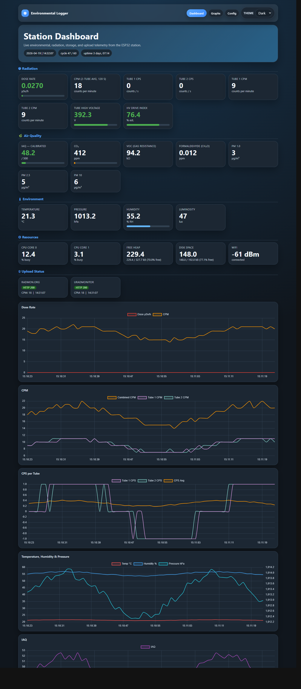
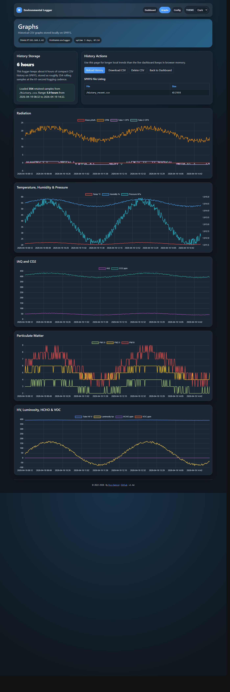
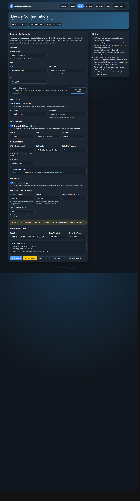

# Environmental Stationary Logger

> **Firmware version:** v1.4d &nbsp;|&nbsp; **Platform:** ESP32 Wrover-E &nbsp;|&nbsp; **Framework:** Arduino (ESP-IDF v5)

A full-featured environmental monitoring station built around the ESP32 Wrover-E.  
It continuously samples ionising radiation (two GM tubes), air quality (IAQ / CO₂ / VOC / HCHO), particulate matter, temperature, pressure, humidity and visible light, then presents everything through a live web dashboard and uploads a summary to public radiation-monitoring platforms every 61 seconds.

---

## Table of Contents

1. [Features](#features)
2. [Hardware](#hardware)
3. [Web Interface](#web-interface)
   - [Dashboard (`/`)](#dashboard-)
   - [Graphs (`/graphs`)](#graphs-graphs)
   - [Configuration (`/config`)](#configuration-config)
4. [CSV History Format](#csv-history-format)
5. [JSON API (`/json`)](#json-api-json)
6. [Upload Platforms](#upload-platforms)
7. [Tube Presets](#tube-presets)
8. [Getting Started](#getting-started)
9. [File Structure](#file-structure)
10. [Firmware Changelog](#firmware-changelog)
11. [Author](#author)

---

## Features

- **Live web dashboard** — card-grid UI with colour-coded gauge bars for IAQ, CO₂, CPM, humidity and tube HV
- **Six live Chart.js graphs** on the dashboard — dose rate, CPM (combined + per-tube), CPS (per-tube + moving average), temperature / humidity / pressure, IAQ, CO₂, PM 1.0 / 2.5 / 10
- **Historical `/graphs` page** — renders the retained on-device CSV history (up to configurable hours) via Chart.js with five full-featured chart cards
- **Rolling SPIFFS history log** — 16-column CSV sampled every 61 seconds; automatic pruning keeps storage bounded; backward-compatible parser handles 12 / 14 / 16 column files
- **Fully end-user configurable** — every tunable parameter is accessible from the `/config` page; no firmware rebuild needed; all settings persisted to NVS (Preferences)
- **Dual-tube dead-time correction** — per-second PCNT hardware counters with configurable dead-time; saturation warning + raw CPS fallback
- **Nine built-in tube presets** + fully custom dead-time / conversion-factor entry
- **DST profiles** — EU, US, AU or None, selectable at runtime
- **OTA firmware updates** via ElegantOTA
- **Per-core CPU load** and heap / SPIFFS diagnostics exposed on the dashboard and in `/json`
- **Fully offline** — no external CDN in the UI shell; Chart.js is the only remote resource

---

## Hardware

| Component | Role | Interface |
|-----------|------|-----------|
| **ESP32 Wrover-E** (dual-core 240 MHz, 4 MB PSRAM) | Main MCU | — |
| **Bosch BME680 + BSEC library** | Temperature, pressure, humidity, IAQ, CO₂eq, VOC | I²C `0x76` |
| **Seeed HM3301** | PM 1.0 / PM 2.5 / PM 10 particulate matter | I²C |
| **TAOS TSL2561** | Visible-light luminosity (lux) | I²C |
| **Grove HCHO sensor** | Formaldehyde (HCHO) analogue | GPIO 34 / ADC |
| **2 × GM tube** (default: SBM-19) | Ionising radiation counts | GPIO 13 + GPIO 14 via PCNT |
| **ADC voltage divider** | GM tube high-voltage monitor | GPIO 33 / ADC |

### Wiring overview

```
GPIO 13  ──►  Tube 1 pulse signal (PCNT Unit 0)
GPIO 14  ──►  Tube 2 pulse signal (PCNT Unit 1)
GPIO 33  ──►  HV monitor (resistor divider → ADC)
GPIO 34  ──►  HCHO analogue output (ADC)
I²C SDA/SCL  ──►  BME680, HM3301, TSL2561
```

> The PCNT filter is set to 100 clock cycles to debounce tube pulses.  
> Both counters are paused, read and cleared every second per ESP-IDF requirements.


---

## Web Interface

All pages share a dark-themed card-grid layout with a persistent navigation bar and a footer containing the firmware version badge (click to open the changelog dialog).

### Dashboard (`/`)

The main page polls `/json` every second and updates all values live.



**Radiation section**
- Combined CPM card with colour-coded gauge bar and estimated dose rate (µSv/h)
- Tube 1 CPM and Tube 2 CPM individual cards
- GM tube high voltage card with operating range indicator

**Environmental section**
- Temperature, humidity, pressure
- IAQ score with accuracy indicator and colour threshold
- CO₂ equivalent (ppm)

**Air quality section**
- PM 1.0, PM 2.5, PM 10 (µg/m³)
- Formaldehyde HCHO (ppb)
- Luminosity (lux)

**System section**
- Upload status badges (radmon.org and uradmonitor) — green / amber / red
- Core 0 / Core 1 CPU load, heap free, SPIFFS free
- WiFi RSSI, uptime, NTP epoch

**Live charts**

| Chart | Datasets |
|-------|----------|
| Dose Rate | µSv/h, CPM |
| CPM | Combined, Tube 1, Tube 2 |
| CPS | Tube 1, Tube 2, moving average |
| Temperature / Humidity / Pressure | °C, %RH (left Y), hPa (right Y) |
| IAQ | IAQ score |
| CO₂ | ppm |
| Particulates | PM 1.0, PM 2.5, PM 10 |

---

### Graphs (`/graphs`)

Renders the on-device CSV history with Chart.js.  
The date range shown is determined by the history retention window configured in `/config`.



| Chart card | Datasets |
|-----------|----------|
| Radiation | Dose (µSv/h), CPM, Tube 1 CPS, Tube 2 CPS |
| Temperature / Humidity | °C, %RH (left Y), pressure hPa (right Y) |
| Air quality | IAQ, CO₂ (ppm) |
| Particulates | PM 1.0, PM 2.5, PM 10 (µg/m³) |
| Environment | HV (V), Luminosity (lux), HCHO (ppb), VOC (ppm) |

Parsed CSV is backward-compatible with all three historical column counts (12, 14, 16).

---

### Configuration (`/config`)

All settings are saved to NVS (ESP32 Preferences) on submit.  
No firmware rebuild is required to change any of these parameters.



#### Network
| Setting | Default | Notes |
|---------|---------|-------|
| WiFi SSID | *(from `arduino_secrets.h`)* | Runtime override |
| WiFi password | *(from `arduino_secrets.h`)* | Runtime override |
| Hostname | `esp32` | Used in browser tab title |
| NTP server | `pool.ntp.org` | Any reachable NTP host |
| Station name | `Station Dashboard` | Shown as page heading |

#### Time
| Setting | Default | Notes |
|---------|---------|-------|
| UTC offset | +60 min | Minutes east of UTC |
| DST profile | EU | EU / US / AU / None |
| DST offset | +60 min | Added when DST is active |

#### Radiation
| Setting | Default | Notes |
|---------|---------|-------|
| Tube preset | SBM-19 | Select from 9 presets or Custom |
| Dead time (µs) | 250 | Per-tube, applied each second |
| Conversion factor (µSv/h per CPM) | 0.001500 | Dose calculation coefficient |
| CPM gauge full-scale | 600 | Dashboard gauge maximum (50 – 10 000) |
| HV calibration factor | 184.097 | Resistor-divider voltage multiplier |

#### Sensors
| Setting | Default | Notes |
|---------|---------|-------|
| HCHO R₀ | 10.37 | Baseline resistance of HCHO sensor |

#### Uploads
| Setting | Default | Notes |
|---------|---------|-------|
| radmon.org upload | Enabled | Toggle on / off |
| uradmonitor upload | Enabled | Toggle on / off |

#### History
| Setting | Default | Notes |
|---------|---------|-------|
| History retention | 6 h | How many hours of CSV to keep on SPIFFS |

#### Verbose serial
| Setting | Default | Notes |
|---------|---------|-------|
| Serial debug output | Enabled | Toggle extra Serial.print output |

---

## CSV History Format

One row is appended every 61 seconds to `/history_recent.csv` on SPIFFS.

```
epoch,cpm,cps_tube1,cps_tube2,temp_c_x10,humidity_pct_x10,pressure_hpa_x10,
iaq_x10,co2_ppm,voc_ppm_x100,pm01_ugm3,pm25_ugm3,pm10_ugm3,
hv_v_x10,luminosity_lux,hcho_ppb
```

| Column | Unit / scale | Example |
|--------|-------------|---------|
| `epoch` | Unix timestamp (s) | `1745012345` |
| `cpm` | counts per minute | `18` |
| `cps_tube1` | counts per second, tube 1 | `0` |
| `cps_tube2` | counts per second, tube 2 | `0` |
| `temp_c_x10` | °C × 10 | `213` → 21.3 °C |
| `humidity_pct_x10` | %RH × 10 | `552` → 55.2 % |
| `pressure_hpa_x10` | hPa × 10 | `10132` → 1013.2 hPa |
| `iaq_x10` | IAQ score × 10 | `500` → 50.0 |
| `co2_ppm` | ppm | `412` |
| `voc_ppm_x100` | ppm × 100 | `8` → 0.08 ppm |
| `pm01_ugm3` | µg/m³ | `3` |
| `pm25_ugm3` | µg/m³ | `5` |
| `pm10_ugm3` | µg/m³ | `6` |
| `hv_v_x10` | volts × 10 | `3923` → 392.3 V |
| `luminosity_lux` | lux | `47` |
| `hcho_ppb` | ppb | `12` |

The `/history_recent.csv` file and its header can be downloaded at `/history.csv`.  
The file is deleted (pruned to zero) via `DELETE /history` (accessible from `/config`).

---

## JSON API (`/json`)

`GET /json` returns a JSON object updated every second by the main loop.

```jsonc
{
  "cpm": 18,
  "cpm1": 9,          // Tube 1 CPM
  "cpm2": 9,          // Tube 2 CPM
  "tube1": 0,         // Tube 1 CPS (dead-time corrected)
  "tube2": 0,         // Tube 2 CPS (dead-time corrected)
  "sensorMovingAvg": 0,
  "tubeVoltage": 392.3,
  "iaq": 50.0,
  "iaqAccuracy": 3,
  "temperature": 21.3,
  "humidity": 55.2,
  "pressure": 1013.2,
  "co2": 412.0,
  "voc": 0.08,
  "pm01": 3,
  "pm25": 5,
  "pm10": 6,
  "hcho": 12.0,
  "luminosity": 47,
  "unixTime": 1745012345,
  "cpuLoad0": 12.4,
  "cpuLoad1": 3.1,
  "heapFree": 234512,
  "fsFree": 819200
}
```

---

## Upload Platforms

Both uploads run every 61 seconds on Core 1 via a FreeRTOS task.  
Upload can be individually enabled / disabled from `/config`.

### radmon.org

```
POST http://www.radmon.org/radmon.php
  ?function=submit&user=<USER>&password=<PASS>&value=<CPM>&unit=CPM
```

### data.uradmonitor.com

```
POST http://data.uradmonitor.com/api/v1/upload/exp
Headers:
  X-User-id:   <USER_ID>
  X-User-hash: <API_KEY>
  X-Device-id: <DEVICE_ID>
  X-Payload:   T<temp>|P<pressure>|H<humidity>|L<lux>|V<hv>|W<voc>|F<hcho>|...
```

> Both endpoints use plain HTTP (no TLS).  
> Credentials are stored in `arduino_secrets.h` (git-ignored) and never hard-coded in the main sketch.

---

## Tube Presets

Nine read-only presets are compiled in.  All values can be overridden with a **Custom** entry saved to NVS.

| Preset ID | Label | Dead time (µs) | µSv/h per CPM | HV range (V) |
|-----------|-------|---------------|---------------|--------------|
| `sbm19` | SBM-19 | 250 | 0.001500 | 350 – 475 |
| `sbm20` | SBM-20 | 190 | 0.006315 | 350 – 475 |
| `sts5` | STS-5 | 190 | 0.006315 | 350 – 475 |
| `sbt10` | SBT-10 | 190 | 0.013500 | 350 – 450 |
| `sts6` | STS-6 | 190 | 0.006315 | 380 – 475 |
| `si22g` | SI-22G | 190 | 0.001714 | 380 – 475 |
| `lnd712` | LND-712 | 90 | 0.005940 | 500 – 600 |
| `lnd7317` | LND-7317 | 90 | 0.002100 | 450 – 550 |
| `si3bg` | SI-3BG | 190 | 0.006315 | 380 – 475 |
| `custom` | Custom | user-defined | user-defined | — |

> All presets are practical starting points.  
> Verify dose conversion factors and HV operating ranges against your tube's datasheet and your own calibration before relying on this station for anything beyond comparative background monitoring.

---

## Getting Started

### Prerequisites

- [Arduino IDE](https://www.arduino.cc/en/software) 2.x or later with the **ESP32 board package** (Espressif)
- The following libraries (install via Library Manager):

| Library | Version tested |
|---------|---------------|
| BSEC Software Library | 1.8.x |
| ArduinoJson | 7.x |
| ElegantOTA | 3.x |
| NTP | latest |
| movingAvg | latest |
| ArduinoHttpClient | latest |
| Tomoto_HM330X | latest |

> **Note:** `Wire`, `WiFi`, `WiFiUdp`, `WebServer`, `Preferences`, `SPIFFS`, `EEPROM` and the FreeRTOS / ESP-IDF headers (`esp_heap_caps.h`, `driver/pulse_cnt.h`, etc.) are all bundled with the **Espressif ESP32 board package** — no separate install needed.

### Credentials file

Copy the included template and fill in your values:

```bash
cp arduino_secrets.h.example arduino_secrets.h
```

Then edit `arduino_secrets.h`:

```cpp
#define SECRET_SSID    "YourWiFiSSID"
#define SECRET_PASS    "YourWiFiPassword"

// radmon.org
#define SECRET_RAD_USER  "your_radmon_username"
#define SECRET_RAD_PASS  "your_radmon_password"

// uradmonitor
#define SECRET_UR_USER   "your_uradmonitor_user_id"
#define SECRET_UR_KEY    "your_uradmonitor_api_key"
#define SECRET_UR_DEV    "your_uradmonitor_device_id"
```

### Partition scheme

Select **"Minimal SPIFFS (1.9 MB APP with OTA / 190 KB SPIFFS)"** in the Arduino IDE  
(*Tools → Partition Scheme*).  
The `partitions.csv` in the `build/` folder reflects this layout.

### Build & flash

1. Open `Environmental_Stationary_Logger_V1.4.ino` in Arduino IDE
2. Select **ESP32 Wrover Module** as the board
3. Set partition scheme (see above)
4. Upload via USB or OTA

### First boot

- The device connects to WiFi, syncs NTP and starts serving on `http://<hostname>.local/`
- Open `/config` to adjust any runtime settings; they are saved immediately to NVS
- The dashboard is available at `http://<hostname>.local/`
- Historical graphs load at `http://<hostname>.local/graphs`

---

## File Structure

```
Environmental_Stationary_Logger_V1.4/
├── Environmental_Stationary_Logger_V1.4.ino   Main sketch
├── arduino_secrets.h                           WiFi + API credentials (git-ignored)
├── arduino_secrets.h.example                  Credentials template — copy and fill in
├── logger_user_config.h                        Tube preset definitions + compile-time defaults
├── bsec_iaq.h                                  BSEC binary config (3.3 V, 3s LP, 4d age)
├── README.md
├── images/
│   ├── dashboard.html                          Browser-renderable dashboard preview (dummy data)
│   ├── graphs.html                             Browser-renderable graphs preview (dummy data)
│   ├── config.html                             Browser-renderable config page preview
│   ├── dashboard.png                           Screenshot → save from dashboard.html
│   ├── graphs.png                              Screenshot → save from graphs.html
│   └── config.png                              Screenshot → save from config.html
├── src/
│   ├── Digital_Light_TSL2561.h / .cpp          Local TSL2561 luminosity driver
│   ├── Seeed_HM330X.h / .cpp                  Local HM3301 PM sensor driver
│   ├── I2COperations.h / .cpp                 I²C scan helper
│   └── HM330XErrorCode.h                      PM sensor error codes
└── data/
    └── bsec_iaq.txt                            BSEC state storage reference
```

---

## Firmware Changelog

### v1.4d (2026-04-19) — Dashboard & telemetry expansion
- Per-tube CPM cards (Tube 1, Tube 2) on dashboard
- Live CPM chart: combined + per-tube CPM
- New live CPS chart: Tube 1, Tube 2, moving average
- Live TH chart: pressure added on right Y-axis
- CSV history expanded to 16 columns: `cps_tube1`, `cps_tube2`, `pressure_hpa_x10`, `voc_ppm_x100`; pressure bug fixed (was Pa×10, now hPa×10)
- `/graphs`: Tube CPS on Radiation chart; VOC on Env chart; pressure on TH chart (dual Y-axis)
- `parseCsv` backward-compatible with 12 / 14 / 16-column files
- JSON: `cpm1`, `cpm2` fields added
- `FIRMWARE_VERSION` constant; footer version badge opens a native changelog dialog
- ☢ favicon as inline SVG data URI on all pages
- Page title: `hostname : Environmental Logger`
- OTA / JSON nav links shown only on `/config` page
- Theme picker moved into topbar nav (all pages)
- Footer icon: inline SVG DZ badge (offline-capable, no external requests)

### v1.4c (2026-04-18) — Local history logging + end-user configuration
- Rolling CSV history on SPIFFS (61-second cadence)
- `/graphs` page renders retained CSV via Chart.js
- Automatic CSV pruning keeps storage bounded
- `pruneHistoryLogIfNeeded()`: O(n) scan replaced with O(1) `historyRowCount` counter (initialised from SPIFFS at boot)
- All settings on `/config` with NVS persistence; no firmware rebuild needed
- Tube preset library: 9 built-in presets + custom
- DST profiles: EU, US, AU, None (runtime selectable)
- Configurable: NTP server, station name, CPM gauge full-scale, history retention, upload enable/disable
- Footer on all pages with author, links, dynamic year

### v1.4b (2026-04-18) — Reliability + diagnostics
- Graceful HM330X / PCNT failure handling
- Upload status rendered from locked snapshot (no torn cross-core reads)
- Dead-time saturation: warning + raw CPS fallback
- Per-core CPU load on dashboard and `/json`
- `/json` `unixTime` now reports current NTP epoch

### v1.4a (2026-03-20) — Cleanup / correctness
- BSEC save cadence uses elapsed time (not counter)
- 1 ms cooperative loop delay
- Tube dead time + conversion factor in JSON payload
- HV upload helper renamed for clarity

### v1.4 (2026-03-20) — PCNT driver migration
- Migrated from deprecated `driver/pcnt.h` to modern `driver/pulse_cnt.h` (ESP-IDF API)

### v1.3 (2026-03-19) — Dashboard overhaul
- Dark-themed card-grid UI with colour-coded gauge bars
- Six live Chart.js graphs via `/json` polling
- Streaming HTTP response (`webPageChunks`)
- Upload status badges (green / red)

### v1.2 (2026-03-18) — 20+ bug-fix / hardening items
- BSEC, PCNT, FreeRTOS task safety, JSON, dead-time, ADC 12-bit correction, upload race condition fixes

### v1.1 (2024-xx-xx)
- Added HM3301 PM sensor, TSL2561 light sensor, Grove HCHO sensor
- Hardware PCNT counters, ArduinoJson v7, uradmonitor.com upload

### v1.0 (2022-09-20)
- Initial release: Geiger counter + BME680 + radmon.org upload

---

## Author

**Don Zalmrol**  
[don-zalmrol.be](https://www.don-zalmrol.be)

---

> **Disclaimer:** Dose-rate readings are for comparative background monitoring only.  
> Verify all tube conversion factors and operating voltage ranges against your tube's datasheet and a calibrated reference source before drawing quantitative conclusions.
